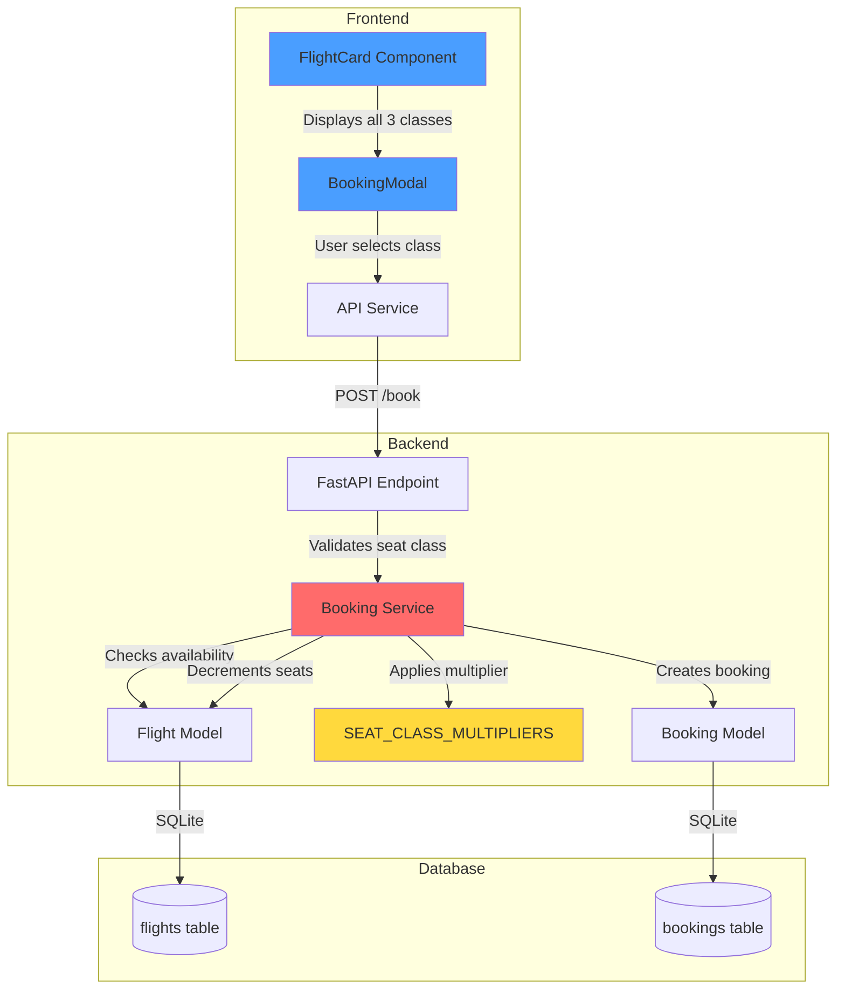
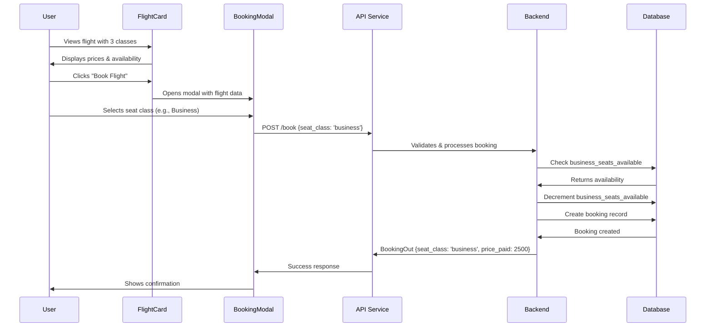

# Seat Classes Architecture - Galaxium Travels

## Overview

Galaxium Travels supports three distinct seat classes with different pricing tiers and availability:
- **Economy Class** (1x base price) - 60% of total seats
- **Business Class** (2.5x base price) - 30% of total seats  
- **Galaxium Class** (5x base price) - 10% of total seats

## Current Implementation Status

✅ **FULLY IMPLEMENTED** - All three seat classes are operational across the entire stack.

---

## Architecture Diagram



---

## Backend Implementation

### 1. Database Schema (models.py)

**Flight Model:**
```python
class Flight(Base):
    __tablename__ = 'flights'
    flight_id = Column(Integer, primary_key=True)
    origin = Column(String, nullable=False)
    destination = Column(String, nullable=False)
    departure_time = Column(String, nullable=False)
    arrival_time = Column(String, nullable=False)
    base_price = Column(Integer, nullable=False)  # Economy price (1x)
    economy_seats_available = Column(Integer, nullable=False)  # 60% of total
    business_seats_available = Column(Integer, nullable=False)  # 30% of total
    galaxium_seats_available = Column(Integer, nullable=False)  # 10% of total
```

**Booking Model:**
```python
class Booking(Base):
    __tablename__ = 'bookings'
    booking_id = Column(Integer, primary_key=True)
    user_id = Column(Integer, ForeignKey('users.user_id'))
    flight_id = Column(Integer, ForeignKey('flights.flight_id'))
    status = Column(String, nullable=False)
    booking_time = Column(String, nullable=False)
    seat_class = Column(String, nullable=False, default='economy')
    price_paid = Column(Integer, nullable=False)
```

### 2. Price Multipliers (services/booking.py:8)

```python
SEAT_CLASS_MULTIPLIERS = {
    'economy': 1.0,
    'business': 2.5,
    'galaxium': 5.0
}
```

**Critical Pattern:** Prices are calculated in code, not stored in database. This allows dynamic pricing adjustments without schema changes.

### 3. Type Safety (schemas.py:5)

```python
SeatClass = Literal['economy', 'business', 'galaxium']
```

Ensures type safety across the entire backend stack.

### 4. Booking Logic (services/booking.py:15-89)

**Key Features:**
- Validates seat class against SEAT_CLASS_MULTIPLIERS
- Checks seat availability for specific class
- Applies correct price multiplier
- Decrements correct seat counter
- Stores seat class and price paid in booking record

---

## Frontend Implementation

### 1. Type Definitions (src/types/index.ts)

```typescript
export type SeatClass = 'economy' | 'business' | 'galaxium';

export interface Flight {
  flight_id: number;
  origin: string;
  destination: string;
  departure_time: string;
  arrival_time: string;
  base_price: number;
  economy_seats_available: number;
  business_seats_available: number;
  galaxium_seats_available: number;
  economy_price: number;
  business_price: number;
  galaxium_price: number;
}
```

### 2. Flight Display (components/flights/FlightCard.tsx:16-47)

**Visual Representation:**
- Economy: Blue theme with Plane icon
- Business: Purple theme with Crown icon
- Galaxium: Alien-green theme with Rocket icon

Each class shows:
- Price (formatted currency)
- Available seats
- Visual indicators (icons, colors)

### 3. Booking Flow (components/bookings/BookingModal.tsx)

**Three-Step Process:**
1. **Select** - User chooses seat class
2. **Quote** - System generates price quote (if Java service available)
3. **Hold** - System creates temporary hold (if Java service available)

**Fallback:** Direct booking if Java hold service unavailable.

---

## API Integration

### REST Endpoints

**List Flights:**
```
GET /flights
Response: FlightOut[] (includes all seat class prices and availability)
```

**Book Flight:**
```
POST /book
Body: {
  user_id: number,
  name: string,
  flight_id: number,
  seat_class: 'economy' | 'business' | 'galaxium'
}
Response: BookingOut | ErrorResponse
```

### MCP Tools (for AI Agents)

```python
@mcp.tool()
def book_flight(user_id: int, name: str, flight_id: int, seat_class: str = "economy") -> BookingOut
```

---

## Data Flow

### Booking a Flight



---

## Key Design Decisions

### 1. Price Calculation in Code
**Why:** Allows flexible pricing strategies without database migrations.
**Location:** `SEAT_CLASS_MULTIPLIERS` dict in services/booking.py:8

### 2. Separate Seat Counters
**Why:** Prevents race conditions and simplifies availability checks.
**Implementation:** Three separate columns in Flight model

### 3. Store Price at Booking Time
**Why:** Historical accuracy - preserves actual price paid even if multipliers change.
**Implementation:** `price_paid` column in Booking model

### 4. Type-Safe Seat Classes
**Why:** Prevents invalid seat class values at compile time.
**Implementation:** Literal types in both Python and TypeScript

---

## Testing Considerations

### Backend Tests (tests/test_services.py)

**Test Coverage Needed:**
- ✅ Book flight with each seat class
- ✅ Verify correct price calculation
- ✅ Verify correct seat decrement
- ✅ Handle invalid seat class
- ✅ Handle no seats available for specific class

### Frontend Tests

**Test Coverage Needed:**
- Display all three seat classes
- Select different seat classes
- Show correct prices for each class
- Disable booking when class sold out
- Handle booking success/failure

---

## Future Enhancement Opportunities

### 1. Dynamic Pricing
- Implement demand-based pricing
- Add seasonal multipliers
- Early bird discounts

### 2. Seat Selection
- Visual seat map
- Specific seat assignment
- Seat preferences (window/aisle)

### 3. Class Upgrades
- Allow upgrading after booking
- Calculate upgrade price difference
- Handle availability during upgrade

### 4. Loyalty Program
- Class-based points earning
- Free upgrades for frequent flyers
- Tier-based benefits

---

## Related Files

**Backend:**
- `booking_system_backend/models.py` - Database schema
- `booking_system_backend/schemas.py` - Type definitions
- `booking_system_backend/services/booking.py` - Booking logic
- `booking_system_backend/services/flight.py` - Flight queries
- `booking_system_backend/server.py` - API endpoints

**Frontend:**
- `booking_system_frontend/src/types/index.ts` - Type definitions
- `booking_system_frontend/src/components/flights/FlightCard.tsx` - Display
- `booking_system_frontend/src/components/bookings/BookingModal.tsx` - Booking flow
- `booking_system_frontend/src/services/api.ts` - API integration

**Database:**
- `booking_system_backend/seed.py` - Demo data with all seat classes